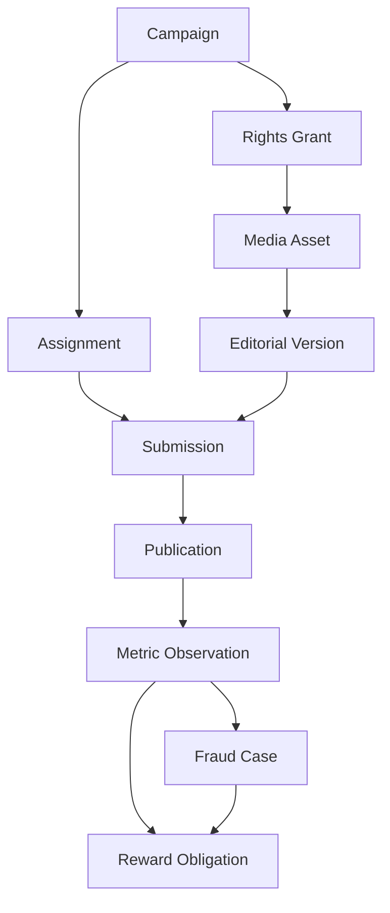

# Z Best Clips Domain Model

## Aggregate ownership

| Aggregate | Authoritative owner | Key invariant |
|---|---|---|
| Campaign | Campaign Authority | cannot activate without scope, budget and rights gates |
| Rights Grant | Legal/Rights | scope and expiry must cover every intended use |
| Media Asset | Media Custody | content checksum is immutable |
| Source Package | Media Custody | creator-specific, expiring and revocable |
| Editorial Version | Editorial Lineage | locked versions cannot be overwritten |
| Creator Profile | Creator Trust | verified identity is separated from campaign profile |
| Assignment | Z Best Clips | eligibility and capacity evaluated at assignment time |
| Submission | Submission Review | all required checkpoints precede approval |
| Publication | Publication Control | requires exact approved version and dual authority |
| Metric Observation | Metric Evidence | source and transformation provenance are mandatory |
| Fraud Case | Independent Risk | operator cannot decide its own case |
| Reward Obligation | Reward Accounting | no obligation without reserved campaign budget |
| Ledger Entry | Finance | balanced, append-only and attributable |
| Appeal | Independent Review | reviewer differs from investigator and money executor |
| Takedown | Legal/Rights or Safety | temporary containment preserves evidence |

## Relationships

## State machines

Campaign:

`DRAFT -> CONTROL_REVIEW -> SIMULATION_READY -> SIMULATION_ACTIVE -> MEASUREMENT_HOLD -> RECONCILED -> ARCHIVED`

Any pre-archive state may enter `SUSPENDED`; only documented remediation may
return it to its prior permitted state. `CANCELLED` and `ARCHIVED` are terminal.

Editorial version:

`DRAFT -> EDITORIAL_REVIEW -> RIGHTS_REVIEW -> TECHNICAL_QC -> PICTURE_LOCKED -> VARIANT_APPROVED -> PUBLISHED`

Changing content after `PICTURE_LOCKED` creates a new version and invalidates
affected downstream approvals.

Reward obligation:

`PROPOSED -> RESERVED -> EARNED_PRELIMINARY -> FRAUD_HOLD -> FINAL_PAYABLE -> TRANSFER_SIMULATED -> RECONCILED`

`QUARANTINED`, `DISPUTED`, and `FAILED_TRANSFER` require explicit recovery paths.
No transition to `FINAL_PAYABLE` is allowed before measurement closure and fraud
review. The pilot prohibits a real provider transfer.

## Identity and evidence

Every command carries `tenantId`, `campaignId`, `actorId`, `actorRole`,
`correlationId`, `causationId`, `idempotencyKey`, and `occurredAt`. Every decision
also carries policy version, evidence references, outcome, and reason codes.

