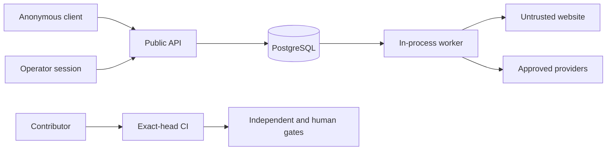

# Z Best Media P1-A Threat Model

## Scope and evidence discipline

This documentation-only model covers `DarksiedCEO/zbestmedia` at base `7056ea4ce24379c93549f0ac9b45ddd7a2600dd6` and runtime evidence from `DarksiedCEO/zbestmedia-ui` at `94376718e07df2e9d44864ed0394d58219224e61`. `model.json` is canonical. Current-state statements below cite `evidence-register.json`; anything else is an assumption, unknown, proposed control, or founder decision.

The repositories provisionally separate specification authority from runtime authority. [EV-SPEC-AUTH] Runtime sessions are HMAC-signed, recheck credential expiry/revocation, and accept a client-selected tenant only when it is in the authenticated principal’s membership; the inspected workspace value is principal-derived. [EV-RUNTIME-AUTH] No PostgreSQL RLS policy was found in the pinned schemas/migrations; deployed database policy remains UNKNOWN. [EV-RUNTIME-DB] Evidence events use ordinary mutable database rows, so tamper-evident custody is NOT_PROVEN. [EV-RUNTIME-EVIDENCE]

User-supplied HTTP(S) URLs drive server requests with timeout and post-read truncation, but the inspected path has no private/link-local/metadata denial, DNS pinning, or per-hop redirect validation. [EV-RUNTIME-FETCH] Jobs run through in-process polling and require later durable-idempotency and recovery proof. [EV-RUNTIME-WORKERS] Exact-head CI is implemented in the specification repository, while branch protection and external trust-root configuration remain UNKNOWN. [EV-SPEC-CI]

## Trust boundaries and data flows



Canonical counts and IDs:

```json p1a-summary
{"actors":22,"actions":28,"authorityRules":616,"assets":8,"trustBoundaries":7,"dataFlows":5,"sourceToSinkPaths":5,"tenantPropagationStages":7,"threats":31,"controls":13,"tenantOperations":18,"credentialClasses":10,"escalationChains":31,"founderDecisions":3,"sourceEvidenceReferences":18}
```

Trust boundaries are `BND-001`, `BND-002`, `BND-003`, `BND-004`, `BND-005`, `BND-006`, and `BND-007`; flows are `FLW-001` through `FLW-005`. The authority policy expands every actor/action pair from a fail-closed default plus actor-specific overrides. Proposed permissions are policy design, not proof of runtime enforcement.

## Threat register

| ID | Threat | Severity |
|---|---|---|
| THR-001 | SSRF | CRITICAL |
| THR-002 | DNS rebinding | CRITICAL |
| THR-003 | metadata-service access | CRITICAL |
| THR-004 | tenant spoofing | CRITICAL |
| THR-005 | workspace spoofing | HIGH |
| THR-006 | cross-tenant access | CRITICAL |
| THR-007 | horizontal privilege escalation | HIGH |
| THR-008 | vertical privilege escalation | CRITICAL |
| THR-009 | confused deputy | HIGH |
| THR-010 | service-account misuse | CRITICAL |
| THR-011 | background-job context forgery | CRITICAL |
| THR-012 | artifact enumeration | HIGH |
| THR-013 | artifact substitution | CRITICAL |
| THR-014 | evidence forgery | CRITICAL |
| THR-015 | stale evidence reuse | HIGH |
| THR-016 | approval forgery | CRITICAL |
| THR-017 | approval replay | CRITICAL |
| THR-018 | reviewer impersonation | CRITICAL |
| THR-019 | self-certification | CRITICAL |
| THR-020 | CI bypass | CRITICAL |
| THR-021 | credential leakage | CRITICAL |
| THR-022 | credential misuse | CRITICAL |
| THR-023 | SHA substitution | CRITICAL |
| THR-024 | malicious pull request | HIGH |
| THR-025 | tool privilege escalation | CRITICAL |
| THR-026 | prompt injection or poisoned tool result | HIGH |
| THR-027 | duplicate execution | HIGH |
| THR-028 | race condition | HIGH |
| THR-029 | rollback failure audit-log tampering or Sentinel suppression | CRITICAL |
| THR-030 | emergency-access abuse | CRITICAL |
| THR-031 | retry amplification exhaustion or permanent-failure loop | HIGH |

Every threat maps to assets, attacker profiles, boundaries, flows, evidence, controls, and an escalation chain. Every control reverse-maps to threats. Separation rules `SEP-001`, `SEP-002`, `SEP-003`, `SEP-004`, `SEP-005`, `SEP-006`, `SEP-007`, `SEP-008`, and `SEP-009` are explicit: builder cannot approve or certify own work; reviewer cannot mutate reviewed subject; AEGIS cannot implement fixes; Red Team cannot repair findings; Sentinels cannot certify; agents cannot self-approve or certify; database service role cannot define tenant context; credential custodian cannot bypass evidence requirements; emergency elevation is human-approved, time-limited, logged, and separately reviewed.

## Tenant, credential, and escalation decisions

The 18 tenant/workspace operations remain `FOUNDER_DECISION_REQUIRED`. Proposed authority derives principal, tenant, and workspace server-side; client values are hints only; denials log; sensitive transfers/deletion/export/restore/elevation require human approval. This is not implemented proof.

Founder decisions are `DEC-001` authoritative tenant/workspace architecture, `DEC-002` production credential custody and rotation, and `DEC-003` outbound egress and third-party data policy. All remain `UNRESOLVED_BLOCKS_P1B`.

The 10 credential classes preserve unresolved production custody under `DEC-002`. Agents have no raw credential read authority. Managed short-lived delivery, rotation, revocation, emergency expiry, and audit are proposed controls.

Each HIGH/CRITICAL threat has a distinct `ESC-THR-*` record with detection signal, detection/triage/containment/remediation/approval/certification/closure owners, rollback posture, founder escalation condition, and exact closure evidence. External Master Sentinel remains unbuilt and is never treated as a current control.

Five source-to-sink paths make entry, intermediate hops, sink, consequence, flow, threats, and evidence explicit. Seven tenant-propagation records trace context through authenticated and public APIs, workers, database, artifacts, evidence, and providers. Retry classification, bounded attempts, backoff/jitter, throttling, quarantine/dead-letter handling, and exhaustion escalation remain proposed under `CTL-013`, not implemented claims.

## Limitations

See `known-limitations.md`. P1-B is blocked. This candidate makes no runtime, tenant-isolation, credential-custody, Sentinel, recovery, production, or security-certification claim.

Repository: DarksiedCEO/zbestmedia+pinned-runtime:DarksiedCEO/zbestmedia-ui
Version: zbestmedia-base@7056ea4ce24379c93549f0ac9b45ddd7a2600dd6; zbestmedia-ui@94376718e07df2e9d44864ed0394d58219224e61
