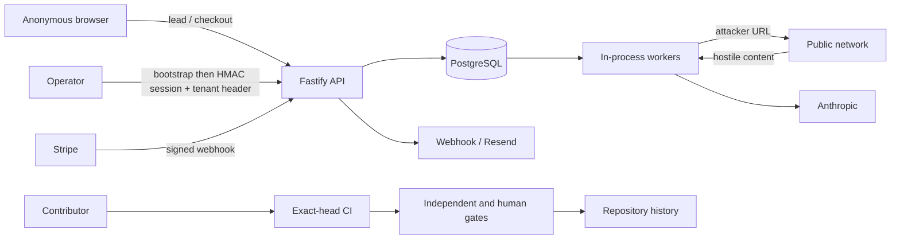

# Z Best Media P1-A Threat Model

## Overview

This is a repository-scoped, design-only threat model for the specification repository at `7056ea4ce24379c93549f0ac9b45ddd7a2600dd6` and the authoritative runtime repository at `94376718e07df2e9d44864ed0394d58219224e61`. It changes no runtime, database, credential, production system, agent activation, or external service. `model.json` is the canonical structured register.

The highest-risk path is anonymous customer URL input flowing into server-side network requests and then model processing. The inspected collector restricts schemes, time, and bytes, but no private/link-local/metadata-address denial or DNS-rebinding defense was found. Tenant membership checks exist, but tenant context remains client-selected and DB-enforced isolation is not proven. Evidence is an ordinary mutable database table, in-process jobs have crash/replay exposure, and runtime Sentinel/tamper-evident proof are not established.

## Trust boundaries and data flows

Authority is provisional: `zbestmedia` owns specifications/construction; `zbestmedia-ui` owns application/runtime; Search Intelligence and Master Sentinel remain separate, unbuilt, and unauthorized. Specification-to-runtime promotion is documentation-only until separately implemented, tested, independently reviewed, and founder-authorized.

## Attacker stories and mitigations

- A malicious lead supplies a metadata, loopback, private, redirecting, or DNS-rebinding URL. Required response: resolve and pin public destinations, deny sensitive ranges on every hop, constrain egress, and destructively test.
- A compromised operator selects tenant/workspace context that reaches an incompletely scoped query. Required response: derive authoritative context server-side and enforce tenant/workspace isolation in both access layer and database.
- Poisoned website text attempts to direct the model or tools. Required response: content remains untrusted data, schemas and provenance constrain outputs, and humans control external decisions.
- A contributor substitutes an artifact, stale approval, CI result, or reviewer identity. Required response: immutable candidate hashes, protected exact-SHA checks, independent identities, append-only signed evidence, and replay prevention.
- A worker crashes or races after an external effect. Required response: durable idempotency, leases/fencing, monotonic state, deterministic recovery, and duplicate/race tests.
- An operator or compromised environment leaks bootstrap, session, provider, payment, or webhook secrets. Required response: managed custody, least privilege, rotation/revocation, redaction, scanning, and drills.

## Severity calibration

CRITICAL means credible cross-tenant disclosure, credential compromise, internal-network access, payment/evidence integrity loss, or release-gate bypass. HIGH means material integrity, availability, privacy, or governance compromise requiring privileged or narrower preconditions. This package identifies controls and validation work; it does not claim those controls are implemented.

## Assumptions and limitations

No `MASTER_BLUEPRINT.md` or `SECURITY.md` was present in either pinned repository. Live deployment topology, configuration, secrets, branch protection, provider policy, database RLS/backups, and deployed SHA were not inspected or inferred. Documentation containing “certified,” “production,” or similar language is treated as a claim, not proof. Three founder decisions in `model.json` remain unresolved and block P1-B.

Repository: DarksiedCEO/zbestmedia+pinned-runtime:DarksiedCEO/zbestmedia-ui
Version: zbestmedia@7056ea4ce24379c93549f0ac9b45ddd7a2600dd6; zbestmedia-ui@94376718e07df2e9d44864ed0394d58219224e61
